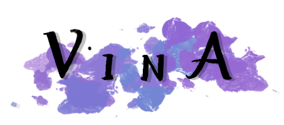

<div align="center">



AI-powered visual novel generator

[](https://crates.io/crates/vina)
[](https://docs.rs/vina)
[](#)

</div>

**VinA** is a visual novel generator. Once you specify a prompt on the type of
story you want, we generate an entire plot, detailed characters with
personalities, locations, music, and more. The result is a fully playable
and polished visual novel you can play.

## Example

With the following prompt:
```
Write a sci-fi story about a hackathon project gone haywire, where twofriends are working
together on a coding project over the weekend. Then, they are sucked into their laptop and
have to find a way back to reality. They overcome an obstacle and successfully return back home.
```

We get this visual novel.

## Features

Dynamic facial expressions depending on the dialogue
<div>
  
  
</div>
<div>
  
  
</div>

Generated background images for each scene
<div>
  
  
</div>

## Usage

To run **VinA** for yourself, you need the following:
- An OpenAI API key, find out how to get one [here](https://platform.openai.com/docs/api-reference/authentication)
- An instance of Automatic1111's stable diffusion web UI, ensure the instance you are using has API support. More info [here](https://github.com/AUTOMATIC1111/stable-diffusion-webui)
- RenPy, installation instructions are [here](https://renpy.org/doc/html/quickstart.html)

The following environment variables should be set:
- `REN_PATH`: path to renpy executable
- `OPENAI_KEY`: your openai API key
- `NOVELAI_URL`: url to your instance of the stable diffusion web UI

## What's with the name?

**VinA** is an anagram of the much less creative name, 'AI VN'.

